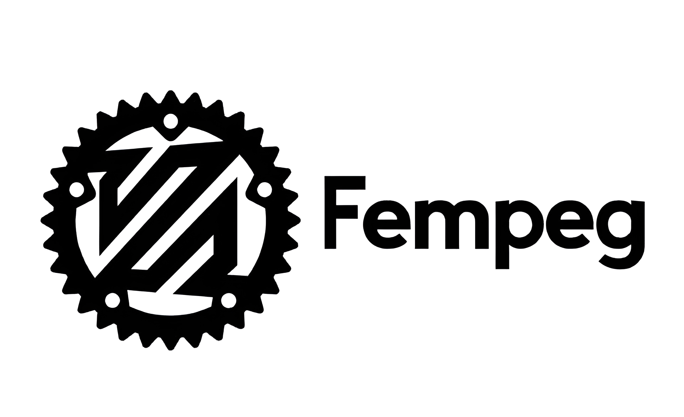

<p align="center">
  
</p>

--- 

A simple program that converts [raw](https://en.wikipedia.org/wiki/Raw_image_format) [NEF](https://www.nikonusa.com/learn-and-explore/c/products-and-innovation/nikon-electronic-format-nef?srsltid=AfmBOorvso8GMKgt49omijROAXsl1z6R3ACuhRhtRF0reFP3p4tPBxat) files into processed image files, written in <a href="https://www.rust-lang.org/">Rust</a>.

---

### Installation

#### Windows

Download the `fempeg.exe` from [github releases](https://github.com/SirPigari/fempeg/releases)

#### Unix

Clone the git repository [https://github.com/SirPigari/fempeg.git](https://github.com/SirPigari/fempeg/)

Make sure you have [libraw](https://www.libraw.org/download) installed. 

cd into the cloned directory and run:

```console
cargo build --release
```

Then you will have the output binary in `/target/release/fempeg`

### Usage

Basic usage examples:

- Convert a single NEF to a PNG (default when no output provided):

```console
fempeg photo.NEF
```

- Convert a single NEF to a specific output path or filename:

```console
fempeg photo.NEF -o /output/photo_out.png
```

- Convert a directory of NEF files (writes outputs into an output directory):

```console
fempeg /nefs -o /out --format png
```

- Convert to multiple formats at once (use `+` between formats):

```console
fempeg photo.NEF -o /out -f png+jpeg
```

##### Flags:

- `-r, --ratio <R>`  : Resize output image by ratio (0 < R <= 1). Default: 0.15
- `-t, --threads <N>`: Number of threads to use (default: number of CPU cores)
- `-p, --preview`    : Use the embedded preview image (if available) instead of full raw processing
- `-b, --brightness [VAL]`: Brightness control. No flag = leave as-is. `-b` without value => auto. Accepts `auto|none|<float>|<int>|<percent>%`.
- `-R, --rotation <VAL>` : `auto` to use EXIF orientation or explicit degrees (90,180,270)
- `-e, --enhance`    : Apply a light enhancement (unsharpen + small contrast)
- `-d, --debug`      : Enable debug output
- `--sort <METHOD>`  : Sort input files before processing (name, numeric, size, mtime)
- `-h, --help`       : Show help message


### Dependencies

Fempeg uses `libraw` underhood for the RAW conversion. This comes with the executable itself on windows, but on other platforms you have to install it yourself.

All other dependencies are managed by `cargo`.

> **Note:** Fempeg has been tested only with Nikon NEF files.  
> While libraw supports most Nikon cameras, some newer or software-generated NEFs may not decode correctly.

### License

fempeg uses the [MIT License](./LICENSE)
