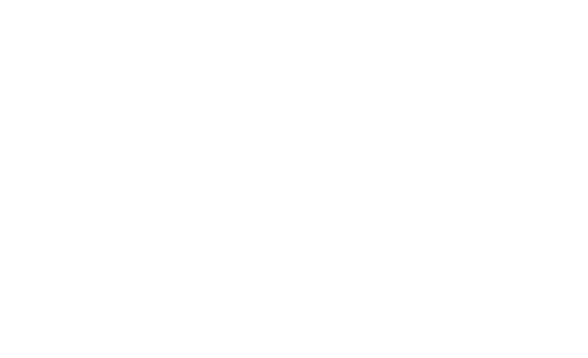

   <!-- Father, forgive me for what i have sinned, i used webp -->
  

---

# Fempeg

**Fempeg** is a Rust program that converts Nikon **NEF** RAW files into processed image formats like PNG or JPEG.

---

## Installation

### Windows
On [GitHub releases](https://github.com/SirPigari/fempeg/releases), there are **two versions**:  

1. `fempeg.exe` → **Without ExifTool**  
   - Includes only some basic EXIF info (printed to console).  
   - Smaller file size (~3MB).  
   - No additional dependencies required.  

2. `fempeg-exif.exe` → **With ExifTool**  
   - Full EXIF support, including the `-i` interactive TUI for searching EXIF info.  
   - Larger file size (~36MB).  
   - No additional dependencies required.  

Download the version that fits your needs.

### Unix
'''
git clone https://github.com/SirPigari/fempeg.git
cd fempeg
'''

- **Without ExifTool:**  
'''
cargo build --release
'''

- **With ExifTool:**  
'''
cargo build --release --features include_exiftool
'''

Make sure you have [libraw](https://www.libraw.org/download) and [exiftool](https://exiftool.org/) installed if using the `include_exiftool` feature.  

The output binary will be in `target/release/fempeg`.

---

## Usage

### Convert a single NEF to PNG (default)
'''console
fempeg ./photo.NEF
'''

### Convert a single NEF to a specific output path
'''console
fempeg photo.NEF -o ./output/photo_out.png
'''

### Convert a directory of NEFs
'''console
fempeg ./nefs -o ./out --format png
'''

### Convert to multiple formats at once
'''console
fempeg photo.NEF -o ./out -f png+jpeg
'''

### Flags
- `-r, --ratio <R>` → Resize output image by ratio (0 < R <= 1), default: 0.15  
- `-t, --threads <N>` → Number of threads to use, default: number of CPU cores  
- `-p, --preview` → Use the embedded preview image instead of full RAW processing  
- `-b, --brightness [VAL]` → Brightness control. Accepts `auto|none|<float>|<int>|<percent>%`. No flag = leave as-is. `-b` without value => auto  
- `-R, --rotation <VAL>` → `auto` to use EXIF orientation or explicit degrees (90,180,270)  
- `-e, --enhance` → Apply a light enhancement (unsharpen + small contrast)  
- `-d, --debug` → Enable debug output  
- `--sort <METHOD>` → Sort input files before processing (name, numeric, size, mtime)  
- `-i, --info` → Show EXIF info about the file, exit afterwards (interactive TUI available if using ExifTool)  
- `-h, --help` → Show help message

---

## Dependencies
- **libraw** → RAW conversion library  
- **ExifTool** → Metadata extraction (included in Windows `fempeg-exif.exe` or via `--features include_exiftool` on Unix)  
- **Windows users do not need to install any dependencies.**  
- All other dependencies are managed by `cargo`

> **Note:** Fempeg has been tested only with Nikon NEF files.  
> While libraw supports most Nikon cameras, some newer or software-generated NEFs may not decode correctly.

---

## License
- [Fempeg License](./LICENSE)  
- [LibRaw License](./LICENSE.LibRaw)  
- [ExifTool License](./LICENSE.ExifTool)
